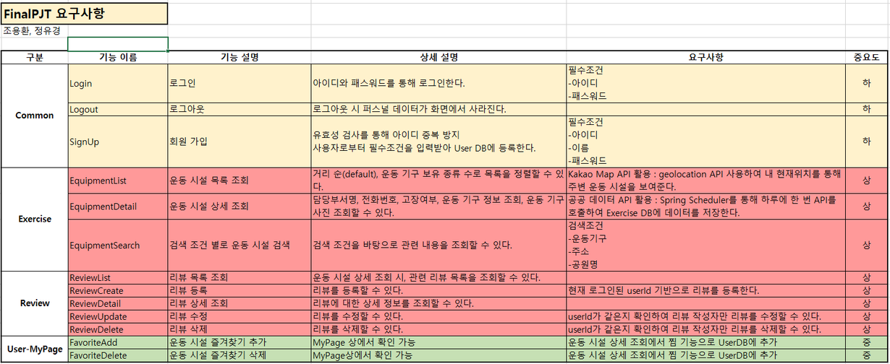
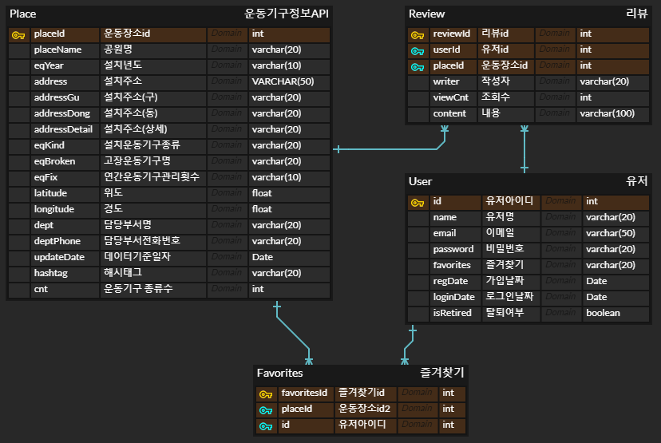
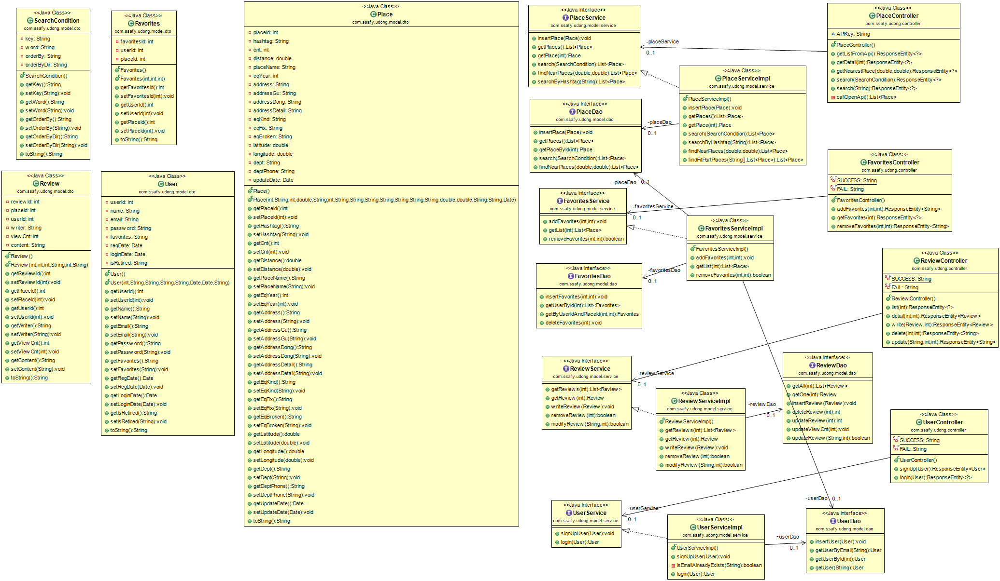
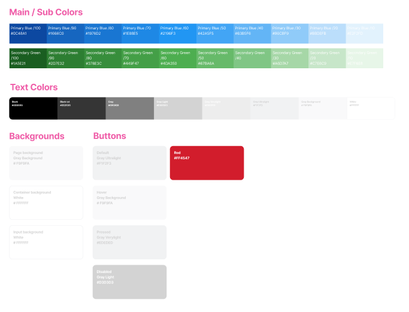
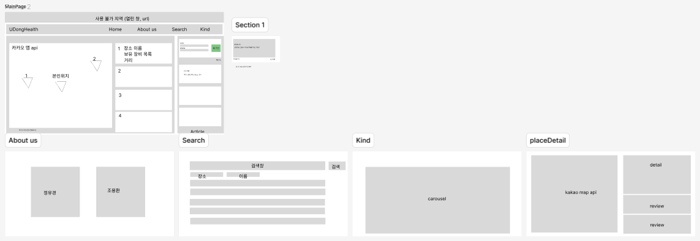

# 🏋️‍♂️ 우리 동네 무료 헬스장 🏋️‍♀️

### 0. 팀원 소개
<table align="center">
    <tr align="center">
        <td style="min-width: 250px;">
            <a href="https://github.com/yhc-key">
              
              <br />
              <b>조용환(팀장)</b>
            </a> 
        </td>
        <td style="min-width: 250px;">
            <a href="https://github.com/yukyung-chung">
              
              <br />
              <b>정유경</b>
            </a>
        </td>
    </tr>
    <tr align="left">
        <td>
        🥨 Front-end<br> 
        1. Color concept, page conpcnet 정하기<br>
	2. Vue3 composition API 기반 page 설계<br>
	3. Kakao map API 기반 위치 정보 제공<br>
	4. 리뷰 등록/수정/삭제 API 통신 기능 구현<br>
	5. 로그인/로그아웃, 회원가입 component 전환<br>
	6. 동적 라우팅 페이지 제작<br>
	7. 반응형 웹페이지 구현<br>
	8. SFC 스타일 활용 프론트앤드 구현<br>
	9. SPA 방식 웹페이지 제작 <br>
        <br/>
        </td>
        <td>
        🍒 Back-end<br>
        1. DB 모델링<br>
	2. Spring MVC 기반 Back-end 기능<br>
	3. 공공 데이터 API 기반 헬스장 정보 조회 기능<br>
	4. 현재 위치 기반 가까운 장소 계산하여 제공<br>
	5. 장소, 주소로 헬스장 검색 기능<br>
	6. 운동 부위 별 데이터 sorting하여 검색 기능<br>
	7. 리뷰 등록/수정/삭제 기능<br>
	8. 즐겨찾기 추가/삭제 기능<br>
	9. 로그인/회원가입 및 유효성 검사<br>
	10. CSS 수정<br>
        <br/>
        </td>
    </tr>
</table>

### 1. Commit & PR Rules
```
태그: 내용

ex) 특정 파일 혹은 기능을 버그를 수정했을 때

git commit -m "Fix: regist.vue - fix login"
```


| 태그 |	설명 |
|----------|--------------|
| Comment | 필요한 주석 추가 및 변경 |
| Design | Css 적용 및 디자인 관련 수정 |
| Docs | 문서 수정(README.md 포함) |
| Error | 오류로 인한 상황시 |
| Feat | 새로운 기능 및 파일 추가 |
| Fix | 버그 수정 |
| Rename | 파일 혹은 폴더명을 수정하거나 옮기는 작업만인 경우 |
| Remove | 파일을 삭제하는 작업만 수행한 경우 |

<br/>

### 2. 요구사항 정의서



### 3. 테이블 구조도(ERD)


### 4. 클래스 다이어그램


### 5. 화면 설계서<br />




### 6. 프로젝트 구조<br />

<details>
<summary>FRONTEND 자료 구조</summary>
<br/>
📦vue-final-pjt <br>
 ┣ 📂.vscode <br>
 ┃ ┗ 📜extensions.json <br>
 ┣ 📂public <br>
 ┣ 📂src <br>
 ┃ ┣ 📂assets <br>
 ┃ ┃ ┣ 📂fit <br>
 ┃ ┃ ┃ ┣ 📜arm.png <br>
 ┃ ┃ ┃ ┣ 📜back.png <br>
 ┃ ┃ ┃ ┣ 📜belly.png <br>
 ┃ ┃ ┃ ┣ 📜body.png <br>
 ┃ ┃ ┃ ┣ 📜cardio.png <br>
 ┃ ┃ ┃ ┣ 📜chest.png <br>
 ┃ ┃ ┃ ┣ 📜endurance.png <br>
 ┃ ┃ ┃ ┣ 📜flexibility.png <br>
 ┃ ┃ ┃ ┣ 📜leg.png <br>
 ┃ ┃ ┃ ┣ 📜shoulder.png <br>
 ┃ ┃ ┃ ┣ 📜stretching.png <br>
 ┃ ┃ ┃ ┣ 📜upperBody.png <br>
 ┃ ┃ ┃ ┣ 📜waist.png <br>
 ┃ ┃ ┃ ┗ 📜weight.png <br>
 ┃ ┃ ┣ 📂복부 <br>
 ┃ ┃ ┃ ┣ 📜롤링웨이브.jpg <br>
 ┃ ┃ ┃ ┣ 📜롤스트레칭.jpg <br>
 ┃ ┃ ┃ ┣ 📜바디싣업.jpg <br>
 ┃ ┃ ┃ ┣ 📜옆파도타기.jpg <br>
 ┃ ┃ ┃ ┣ 📜윗몸일으키기.jpg <br>
 ┃ ┃ ┃ ┣ 📜트위스트.jpg <br>
 ┃ ┃ ┃ ┣ 📜허리돌리기.jpg <br>
 ┃ ┃ ┃ ┣ 📜허리등안마기.jpg <br>
 ┃ ┃ ┃ ┗ 📜허리스트레칭.jpg <br>
 ┃ ┃ ┣ 📂상체 <br>
 ┃ ┃ ┃ ┣ 📜바웨이트.jpg <br>
 ┃ ┃ ┃ ┣ 📜상체근육풀기.jpg <br>
 ┃ ┃ ┃ ┣ 📜어깨근육풀기.jpg <br>
 ┃ ┃ ┃ ┣ 📜역기내리기.jpg <br>
 ┃ ┃ ┃ ┣ 📜역기올리기.jpg <br>
 ┃ ┃ ┃ ┣ 📜터닝암.jpg <br>
 ┃ ┃ ┃ ┣ 📜트윈터닝암.jpg <br>
 ┃ ┃ ┃ ┣ 📜팔어깨근육풀기.jpg <br>
 ┃ ┃ ┃ ┣ 📜풀웨이트.jpg <br>
 ┃ ┃ ┃ ┗ 📜핸드웨이트.jpg <br>
 ┃ ┃ ┣ 📂하체 <br>
 ┃ ┃ ┃ ┣ 📜다리뻗기.jpg <br>
 ┃ ┃ ┃ ┣ 📜레그스트레칭.jpg <br>
 ┃ ┃ ┃ ┣ 📜레그프레스.jpg <br>
 ┃ ┃ ┃ ┣ 📜워킹싸이클론.jpg <br>
 ┃ ┃ ┃ ┣ 📜크로스워킹.jpg <br>
 ┃ ┃ ┃ ┗ 📜하늘걷기.jpg <br>
 ┃ ┃ ┣ 📜logo.png <br>
 ┃ ┃ ┣ 📜running.jpg <br>
 ┃ ┃ ┣ 📜walking.mp4 <br>
 ┃ ┃ ┣ 📜yhC.png <br>
 ┃ ┃ ┗ 📜ykC.png <br>
 ┃ ┣ 📂components <br>
 ┃ ┃ ┣ 📂common <br>
 ┃ ┃ ┃ ┣ 📜TheFavList.vue <br>
 ┃ ┃ ┃ ┣ 📜TheFooter.vue <br>
 ┃ ┃ ┃ ┣ 📜TheHeaderNav.vue <br>
 ┃ ┃ ┃ ┣ 📜TheKindCarousel.vue <br>
 ┃ ┃ ┃ ┣ 📜TheLecList.vue <br>
 ┃ ┃ ┃ ┣ 📜TheLoginForm.vue <br>
 ┃ ┃ ┃ ┣ 📜TheMastHead.vue <br>
 ┃ ┃ ┃ ┗ 📜TheSigninForm.vue <br>
 ┃ ┃ ┣ 📂review <br>
 ┃ ┃ ┃ ┣ 📜ReviewAddView.vue <br>
 ┃ ┃ ┃ ┣ 📜ReviewEditView.vue <br>
 ┃ ┃ ┃ ┗ 📜TheReviewList.vue <br>
 ┃ ┃ ┗ 📂search <br>
 ┃ ┃ ┃ ┣ 📜SearchFit.vue <br>
 ┃ ┃ ┃ ┗ 📜SearchPlace.vue <br>
 ┃ ┣ 📂router <br>
 ┃ ┃ ┗ 📜index.js <br>
 ┃ ┣ 📂stores <br>
 ┃ ┃ ┣ 📜place.js <br>
 ┃ ┃ ┗ 📜user.js <br>
 ┃ ┣ 📂views <br>
 ┃ ┃ ┣ 📜AboutView.vue <br>
 ┃ ┃ ┣ 📜HomeView.vue <br>
 ┃ ┃ ┣ 📜KindView.vue <br>
 ┃ ┃ ┣ 📜PlaceDetailView.vue <br>
 ┃ ┃ ┣ 📜SearchView.vue <br>
 ┃ ┃ ┗ 📜TheSignupView.vue <br>
 ┃ ┣ 📜App.vue <br>
 ┃ ┗ 📜main.js <br>
 ┣ 📜.env <br>
 ┣ 📜.gitignore <br>
 ┣ 📜index.html <br>
 ┣ 📜package-lock.json <br>
 ┣ 📜package.json <br>
 ┗ 📜vite.config.js <br>
</details>


<details>
<summary>BACKEND 자료 구조</summary>
<br />
📦spring-final-pjt<br />
 ┣ 📂src<br />
 ┃ ┣ 📂main<br />
 ┃ ┃ ┣ 📂java<br />
 ┃ ┃ ┃ ┗ 📂com<br />
 ┃ ┃ ┃ ┃ ┗ 📂ssafy<br />
 ┃ ┃ ┃ ┃ ┃ ┗ 📂udong<br />
 ┃ ┃ ┃ ┃ ┃ ┃ ┣ 📂config<br />
 ┃ ┃ ┃ ┃ ┃ ┃ ┃ ┣ 📜DBConfig.java<br />
 ┃ ┃ ┃ ┃ ┃ ┃ ┃ ┣ 📜SwaggerConfig.java<br />
 ┃ ┃ ┃ ┃ ┃ ┃ ┃ ┗ 📜WebConfig.java<br />
 ┃ ┃ ┃ ┃ ┃ ┃ ┣ 📂controller<br />
 ┃ ┃ ┃ ┃ ┃ ┃ ┃ ┣ 📜FavoritesController.java<br />
 ┃ ┃ ┃ ┃ ┃ ┃ ┃ ┣ 📜PlaceController.java<br />
 ┃ ┃ ┃ ┃ ┃ ┃ ┃ ┣ 📜ReviewController.java<br />
 ┃ ┃ ┃ ┃ ┃ ┃ ┃ ┗ 📜UserController.java<br />
 ┃ ┃ ┃ ┃ ┃ ┃ ┣ 📂model<br />
 ┃ ┃ ┃ ┃ ┃ ┃ ┃ ┣ 📂dao<br />
 ┃ ┃ ┃ ┃ ┃ ┃ ┃ ┃ ┣ 📜FavoritesDao.java<br />
 ┃ ┃ ┃ ┃ ┃ ┃ ┃ ┃ ┣ 📜PlaceDao.java<br />
 ┃ ┃ ┃ ┃ ┃ ┃ ┃ ┃ ┣ 📜ReviewDao.java<br />
 ┃ ┃ ┃ ┃ ┃ ┃ ┃ ┃ ┗ 📜UserDao.java<br />
 ┃ ┃ ┃ ┃ ┃ ┃ ┃ ┣ 📂dto<br />
 ┃ ┃ ┃ ┃ ┃ ┃ ┃ ┃ ┣ 📜Favorites.java<br />
 ┃ ┃ ┃ ┃ ┃ ┃ ┃ ┃ ┣ 📜Place.java<br />
 ┃ ┃ ┃ ┃ ┃ ┃ ┃ ┃ ┣ 📜Review.java<br />
 ┃ ┃ ┃ ┃ ┃ ┃ ┃ ┃ ┣ 📜SearchCondition.java<br />
 ┃ ┃ ┃ ┃ ┃ ┃ ┃ ┃ ┗ 📜User.java<br />
 ┃ ┃ ┃ ┃ ┃ ┃ ┃ ┗ 📂service<br />
 ┃ ┃ ┃ ┃ ┃ ┃ ┃ ┃ ┣ 📜FavoritesService.java<br />
 ┃ ┃ ┃ ┃ ┃ ┃ ┃ ┃ ┣ 📜FavoritesServiceImpl.java<br />
 ┃ ┃ ┃ ┃ ┃ ┃ ┃ ┃ ┣ 📜PlaceService.java<br />
 ┃ ┃ ┃ ┃ ┃ ┃ ┃ ┃ ┣ 📜PlaceServiceImpl.java<br />
 ┃ ┃ ┃ ┃ ┃ ┃ ┃ ┃ ┣ 📜ReviewService.java<br />
 ┃ ┃ ┃ ┃ ┃ ┃ ┃ ┃ ┣ 📜ReviewServiceImpl.java<br />
 ┃ ┃ ┃ ┃ ┃ ┃ ┃ ┃ ┣ 📜UserService.java<br />
 ┃ ┃ ┃ ┃ ┃ ┃ ┃ ┃ ┗ 📜UserServiceImpl.java<br />
 ┃ ┃ ┃ ┃ ┃ ┃ ┗ 📜UdongHealthApplication.java<br />
 ┃ ┃ ┗ 📂resources<br />
 ┃ ┃ ┃ ┣ 📂mappers<br />
 ┃ ┃ ┃ ┃ ┣ 📜favoritesMapper.xml<br />
 ┃ ┃ ┃ ┃ ┣ 📜placeMapper.xml<br />
 ┃ ┃ ┃ ┃ ┣ 📜reviewMapper.xml<br />
 ┃ ┃ ┃ ┃ ┗ 📜userMapper.xml<br />
 ┃ ┃ ┃ ┣ 📜application.properties<br />
 ┃ ┃ ┃ ┗ 📜sql.sql<br />
 ┃ ┗ 📂test<br />
 ┃ ┃ ┗ 📂java<br />
 ┃ ┃ ┃ ┗ 📂com<br />
 ┃ ┃ ┃ ┃ ┗ 📂ssafy<br />
 ┃ ┃ ┃ ┃ ┃ ┗ 📂udong<br />
 ┃ ┃ ┃ ┃ ┃ ┃ ┗ 📜UdongHealthApplicationTests.java<br />
 ┣ 📂target<br />
 ┃ ┣ 📂classes<br />
 ┃ ┃ ┣ 📂com<br />
 ┃ ┃ ┃ ┗ 📂ssafy<br />
 ┃ ┃ ┃ ┃ ┗ 📂udong<br />
 ┃ ┃ ┃ ┃ ┃ ┣ 📂config<br />
 ┃ ┃ ┃ ┃ ┃ ┃ ┣ 📜DBConfig.class<br />
 ┃ ┃ ┃ ┃ ┃ ┃ ┣ 📜SwaggerConfig.class<br />
 ┃ ┃ ┃ ┃ ┃ ┃ ┗ 📜WebConfig.class<br />
 ┃ ┃ ┃ ┃ ┃ ┣ 📂controller<br />
 ┃ ┃ ┃ ┃ ┃ ┃ ┣ 📜FavoritesController.class<br />
 ┃ ┃ ┃ ┃ ┃ ┃ ┣ 📜PlaceController.class<br />
 ┃ ┃ ┃ ┃ ┃ ┃ ┣ 📜ReviewController.class<br />
 ┃ ┃ ┃ ┃ ┃ ┃ ┗ 📜UserController.class<br />
 ┃ ┃ ┃ ┃ ┃ ┣ 📂model<br />
 ┃ ┃ ┃ ┃ ┃ ┃ ┣ 📂dao<br />
 ┃ ┃ ┃ ┃ ┃ ┃ ┃ ┣ 📜FavoritesDao.class<br />
 ┃ ┃ ┃ ┃ ┃ ┃ ┃ ┣ 📜PlaceDao.class<br />
 ┃ ┃ ┃ ┃ ┃ ┃ ┃ ┣ 📜ReviewDao.class<br />
 ┃ ┃ ┃ ┃ ┃ ┃ ┃ ┗ 📜UserDao.class<br />
 ┃ ┃ ┃ ┃ ┃ ┃ ┣ 📂dto<br />
 ┃ ┃ ┃ ┃ ┃ ┃ ┃ ┣ 📜Favorites.class<br />
 ┃ ┃ ┃ ┃ ┃ ┃ ┃ ┣ 📜Place.class<br />
 ┃ ┃ ┃ ┃ ┃ ┃ ┃ ┣ 📜Review.class<br />
 ┃ ┃ ┃ ┃ ┃ ┃ ┃ ┣ 📜SearchCondition.class<br />
 ┃ ┃ ┃ ┃ ┃ ┃ ┃ ┗ 📜User.class<br />
 ┃ ┃ ┃ ┃ ┃ ┃ ┗ 📂service<br />
 ┃ ┃ ┃ ┃ ┃ ┃ ┃ ┣ 📜FavoritesService.class<br />
 ┃ ┃ ┃ ┃ ┃ ┃ ┃ ┣ 📜FavoritesServiceImpl.class<br />
 ┃ ┃ ┃ ┃ ┃ ┃ ┃ ┣ 📜PlaceService.class<br />
 ┃ ┃ ┃ ┃ ┃ ┃ ┃ ┣ 📜PlaceServiceImpl$1.class<br />
 ┃ ┃ ┃ ┃ ┃ ┃ ┃ ┣ 📜PlaceServiceImpl.class<br />
 ┃ ┃ ┃ ┃ ┃ ┃ ┃ ┣ 📜ReviewService.class<br />
 ┃ ┃ ┃ ┃ ┃ ┃ ┃ ┣ 📜ReviewServiceImpl.class<br />
 ┃ ┃ ┃ ┃ ┃ ┃ ┃ ┣ 📜UserService.class<br />
 ┃ ┃ ┃ ┃ ┃ ┃ ┃ ┗ 📜UserServiceImpl.class<br />
 ┃ ┃ ┃ ┃ ┃ ┗ 📜UdongHealthApplication.class<br />
 ┃ ┃ ┣ 📂mappers<br />
 ┃ ┃ ┃ ┣ 📜favoritesMapper.xml<br />
 ┃ ┃ ┃ ┣ 📜placeMapper.xml<br />
 ┃ ┃ ┃ ┣ 📜reviewMapper.xml<br />
 ┃ ┃ ┃ ┗ 📜userMapper.xml<br />
 ┃ ┃ ┣ 📂META-INF<br />
 ┃ ┃ ┃ ┣ 📂maven<br />
 ┃ ┃ ┃ ┃ ┗ 📂com.ssafy<br />
 ┃ ┃ ┃ ┃ ┃ ┗ 📂UdongHealth<br />
 ┃ ┃ ┃ ┃ ┃ ┃ ┣ 📜pom.properties<br />
 ┃ ┃ ┃ ┃ ┃ ┃ ┗ 📜pom.xml<br />
 ┃ ┃ ┃ ┗ 📜MANIFEST.MF<br />
 ┃ ┃ ┣ 📜application.properties<br />
 ┃ ┃ ┗ 📜sql.sql<br />
 ┃ ┗ 📂test-classes<br />
 ┃ ┃ ┗ 📂com<br />
 ┃ ┃ ┃ ┗ 📂ssafy<br />
 ┃ ┃ ┃ ┃ ┗ 📂udong<br />
 ┃ ┃ ┃ ┃ ┃ ┗ 📜UdongHealthApplicationTests.class<br />
 ┣ 📜.classpath<br />
 ┣ 📜.gitignore<br />
 ┣ 📜.project<br />
 ┣ 📜mvnw<br />
 ┣ 📜mvnw.cmd<br />
 ┗ 📜pom.xml<br />
<br />
## 접은 제목<br />
접은 내용<br />
</details><br />


### 7. 소스코드 및 DB 스크립트

<details>
<summary>FRONTEND 프로젝트 소스코드</summary>
<br />

📘 SearchView
```
<template>
    <div class="d-flex flex-wrap">
        <div class="border border-2 rounded p-2 m-1 hover-effect" v-for="(image, index) in images" @click.stop.prevent="handleImageClick(index)">
            
            <p class="text-center my-1">{{ image.alt }}</p>
        </div>
        
    </div>
</template>

<script setup>
import { ref } from 'vue';
import { usePlaceStore} from '../../stores/place'
import axios from 'axios';

const placeStore = usePlaceStore();

const handleImageClick = async(index) => {
    placeStore.fitSearchTF = true;
    const URL = import.meta.env.VITE_APP_API_PLACE_URL + `/search/${images[index].alt}`
    const response = await axios.get(URL);
    placeStore.fitSearchName = images[index].alt;
    placeStore.searchPlaces.value = response.data;
    placeStore.searchPlaces.value.forEach(item => {
    if (item.설치운동기구종류 && item.설치운동기구종류.length > 20) {
        // 만약 kind 속성의 길이가 20을 초과하면 20자로 자름
        item.설치운동기구종류 = item.설치운동기구종류.slice(0, 22) + "...";
    }
});
}

const images = [{
    src : "../src/assets/fit/body.png",
    alt : "온몸"
}, {
    src : "../src/assets/fit/upperBody.png",
    alt : "상체"
}, {
    src : "../src/assets/fit/waist.png",
    alt : "허리"
}, {
    src : "../src/assets/fit/chest.png",
    alt : "가슴" 
},{
    src : "../src/assets/fit/belly.png",
    alt : "배"
}, {
    src : "../src/assets/fit/shoulder.png",
    alt : "어깨"
}, {
    src : "../src/assets/fit/back.png",
    alt : "등"
}, {
    src : "../src/assets/fit/arm.png",
    alt : "팔"
}, {
    src : "../src/assets/fit/leg.png",
    alt : "하체"
}, {
    src : "../src/assets/fit/endurance.png",
    alt : "지구력"
}, {
    src : "../src/assets/fit/weight.png",
    alt : "웨이트"
}, {
    src : "../src/assets/fit/cardio.png",
    alt : "유산소"
}, {
    src : "../src/assets/fit/stretching.png",
    alt : "스트레칭"
}, {
    src : "../src/assets/fit/flexibility.png",
    alt : "유연성"
}]


</script>

<style scoped>

.hover-effect:hover {
  /* 원하는 스타일을 추가하세요 */
  background-color: #E2F2FD;
  cursor: pointer;
}
p{
    font-family: 'Pretendard-Regular';
    font-weight: 600;
}
</style>
```

📘 SearchFit
```
<template>
    <div class="d-flex flex-wrap">
        <div class="border border-2 rounded p-2 m-1 hover-effect" v-for="(image, index) in images" @click.stop.prevent="handleImageClick(index)">
            
            <p class="text-center my-1">{{ image.alt }}</p>
        </div>
        
    </div>
</template>

<script setup>
import { ref } from 'vue';
import { usePlaceStore} from '../../stores/place'
import axios from 'axios';

const placeStore = usePlaceStore();

//이미지 클릭시 이미지에 해당하는 키워드로 api 통신 후 결과값 SearchView를 통해 출력
const handleImageClick = async(index) => {
    placeStore.fitSearchTF = true;
    const URL = import.meta.env.VITE_APP_API_PLACE_URL + `/search/${images[index].alt}`
    const response = await axios.get(URL);
    placeStore.fitSearchName = images[index].alt;
    placeStore.searchPlaces.value = response.data;
    placeStore.searchPlaces.value.forEach(item => {
    if (item.설치운동기구종류 && item.설치운동기구종류.length > 20) {
        // 만약 kind 속성의 길이가 20을 초과하면 20자로 자름
        item.설치운동기구종류 = item.설치운동기구종류.slice(0, 22) + "...";
    }
});
}

const images = [{
    src : "../src/assets/fit/body.png",
    alt : "온몸"
}, {
    src : "../src/assets/fit/upperBody.png",
    alt : "상체"
}, {
    src : "../src/assets/fit/waist.png",
    alt : "허리"
}, {
    src : "../src/assets/fit/chest.png",
    alt : "가슴" 
},{
    src : "../src/assets/fit/belly.png",
    alt : "배"
}, {
    src : "../src/assets/fit/shoulder.png",
    alt : "어깨"
}, {
    src : "../src/assets/fit/back.png",
    alt : "등"
}, {
    src : "../src/assets/fit/arm.png",
    alt : "팔"
}, {
    src : "../src/assets/fit/leg.png",
    alt : "하체"
}, {
    src : "../src/assets/fit/endurance.png",
    alt : "지구력"
}, {
    src : "../src/assets/fit/weight.png",
    alt : "웨이트"
}, {
    src : "../src/assets/fit/cardio.png",
    alt : "유산소"
}, {
    src : "../src/assets/fit/stretching.png",
    alt : "스트레칭"
}, {
    src : "../src/assets/fit/flexibility.png",
    alt : "유연성"
}]


</script>

<style scoped>

.hover-effect:hover {
  /* 원하는 스타일을 추가하세요 */
  background-color: #E2F2FD;
  cursor: pointer;
}
p{
    font-family: 'Pretendard-Regular';
    font-weight: 600;
}
</style>
```

📘 TheReviewList
```
<template>
    <div>
        <table class="table" border="1">
            <thead>
                <tr>
                    <th>작성자</th>
                    <th>내용</th>
                    <th>조회수</th>
                    <th></th>
                    <th></th>
                </tr>
            </thead>
            <tbody class="table-group-divider">
                <tr v-for="review in reviews" :key="review.reviewId">
                    <td>{{ review.writer }}</td>
                    <td>{{ review.content }}</td>
                    <td>{{ review.viewCnt }}</td>

                    <td><button class="btn btn-success" @click="goReviewEdit(review)" :reviewId="review.reviewId">수정</button></td>
                    <td><button class="btn btn-danger" @click="goReviewDelete(review)" :reviewId="review.reviewId">삭제</button></td>
                </tr>
            </tbody>
        </table>
    </div>
</template>

<script setup>
import axios from 'axios';
import { ref, onMounted, watch } from 'vue';
import { useRoute, useRouter } from 'vue-router';
import { usePlaceStore } from '../../stores/place';
import { useUserStore } from '../../stores/user';

const route = useRoute();
const router = useRouter();
const reviews = ref([]);
const userStore = useUserStore();
const placeStore = usePlaceStore();

//review 추가, 유효성 검사
const goReviewEdit = (review) => {
    if (userStore.loginTF === false) {
        alert("로그인을 먼저 해주세요")
        return router.push("/")

    } else if(review.userId !== JSON.parse(sessionStorage.getItem("user")).userId) {
        alert("본인이 작성한 리뷰만 수정 가능합니다.")
        return router.push("/")
    } 
    else {
        
        return router.push({ name: 'reviewEdit', params: { reviewId: review.reviewId, content : review.content } });
    }
}   

//리뷰삭제, 해당 아이디만 삭제할 수 있도록 미리 체크 후 api 통신
const goReviewDelete = async (review) => {
    if (review.userId === JSON.parse(sessionStorage.getItem("user")).userId) {
        try {
            let URL = import.meta.env.VITE_APP_API_REVIEW_URL + "/" + placeStore.reviewPlaceId + "/" + review.reviewId
            let response = await axios.delete(URL);
            URL = import.meta.env.VITE_APP_API_REVIEW_URL + "/" + route.params.placeId
            response = await axios.get(URL);
            reviews.value = response.data;
            alert("삭제 완료되었습니다.")
        } catch (error) {
            console.log(error);
        }
    } else {
        alert("본인이 작성한 리뷰만 삭제 가능합니다.")
    }
}

//placeDetail 접근 시 해당파일 리뷰 가져오기
onMounted(async () => {
    let URL = import.meta.env.VITE_APP_API_REVIEW_URL + "/" + route.params.placeId
    const response = await axios.get(URL);
    reviews.value = response.data;
})
//placeDetail/:id -> placeDetail/:id로 이동할 때 렌더링안되는 문제 해결용
watch(()=> route.params.placeId, async(newParam, oldParam) => {
    let URL = import.meta.env.VITE_APP_API_REVIEW_URL + "/" + route.params.placeId
    const response = await axios.get(URL);
    reviews.value = response.data;
})

</script>

<style scoped>
.btn-success {
    background-color : #2D7E32;
    border-color : #2D7E32;
}
</style>
```

</details>

<details>
<summary>BACKEND 프로젝트 소스코드</summary>
<br />
📗 SearchByHashtag

    // 해시태그로 검색 기능
    @Override
    public List<Place> SearchByHashtag(String hashtag) {
    // 장소 전체 불러오기
    List<Place> placeList = placeDao.getPlaces();
        // 필터링된 장소 저장할 리스트
        List<Place> filteredList = new ArrayList<>();

        if (hashtag.equals("온몸")) {
            filteredList = findFitPartPlaces(new String[] { ".*몸.*", ".*바디.*" }, placeList);
        } else if (hashtag.equals("상체")) {
            filteredList = findFitPartPlaces(new String[] { ".*상체.*"}, placeList);
        } else if (hashtag.equals("허리")) {
            filteredList = findFitPartPlaces(new String[] { ".*허리.*", ".*옆.*" }, placeList);
        }else if (hashtag.equals("가슴")) {
            filteredList = findFitPartPlaces(new String[] { ".*가슴.*", ".*바스트.*" }, placeList);
        }else if (hashtag.equals("배")) {
            filteredList = findFitPartPlaces(new String[] { ".*뱃살.*", ".*배.*",".*복근.*" }, placeList);
        }else if (hashtag.equals("어깨")) {
            filteredList = findFitPartPlaces(new String[] { ".*어깨.*", ".*숄더.*" }, placeList);
        }else if (hashtag.equals("등")) {
            filteredList = findFitPartPlaces(new String[] { ".*등.*" }, placeList);
        }else if (hashtag.equals("팔")) {
            filteredList = findFitPartPlaces(new String[] { ".*팔.*", ".*암.*" }, placeList);
        }else if (hashtag.equals("하체")) {
            filteredList = findFitPartPlaces(new String[] { ".*다리.*", ".*레그.*",".*하체.*",".*발.*" }, placeList);
        } else if (hashtag.equals("지구력")) {
            filteredList = findFitPartPlaces(new String[] { ".*봉.*", ".*턱걸이.*", ".*매달리기.*", ".*노젓기.*" }, placeList);
        } else if (hashtag.equals("웨이트")) {
            filteredList = findFitPartPlaces(new String[] { ".*웨이트.*", ".*역기.*",".*당기기.*",".*프레스.*" }, placeList);
        } else if (hashtag.equals("유산소")) {
            filteredList = findFitPartPlaces(new String[] { ".*달리기.*", ".*런닝.*", ".*마라톤.*",".*조깅.*",".*유산소.*",".*걷기.*",".*워킹.*",".*워크.*",".*워커.*",".*스탭.*",".*사이클.*",".*싸이클.*",".*자전거.*" }, placeList);
        } else if (hashtag.equals("스트레칭")) {
            filteredList = findFitPartPlaces(new String[] { ".*지압.*", ".*안마.*",".*마사지.*",".*풀기.*",".*스트레칭.*" }, placeList);
        } else if (hashtag.equals("유연성")) {
            filteredList = findFitPartPlaces(new String[] { ".*유연성.*", ".*돌리기.*",".*트위스트.*",".*스윙.*",".*롤링.*" }, placeList);
        }
        return filteredList;
    }


📗 findFitPartPlaces

    //해시태그에 해당하는 값 찾는 메서드
    public List<Place> findFitPartPlaces(String[] patterns, List<Place> placeList) {
        //필터링 된 데이터 저장할 리스트
        List<Place> filteredList = new ArrayList<>();
        Map<Integer, List<String>> placeMap = new HashMap<>();

        for (Place p : placeList) {
            if (p.getEqKind() == null) {
                continue;
            }
            String[] strList = p.getEqKind().split(",");
            List<String> matchedEqKinds = new ArrayList<>();

            //자바에서 제공하는 Pattern, Matcher 클래스 이용
            for (String s : strList) {
                for (String pattern : patterns) {
                    Pattern regex = Pattern.compile(pattern);
                    Matcher matcher = regex.matcher(s);
                    if (matcher.find()) {
                        matchedEqKinds.add(s);
                    }
                }
            }

            // 해당하는 값을 찾았다면 map에 저장
            if (!matchedEqKinds.isEmpty()) {
                int placeId = p.getPlaceId();
                if (placeMap.containsKey(placeId)) {
                    placeMap.get(placeId).addAll(matchedEqKinds);
                } else {
                    placeMap.put(placeId, new ArrayList<>(matchedEqKinds));
                }
            }
        }
        //Map 순회
        for (Map.Entry<Integer, List<String>> entry : placeMap.entrySet()) {
            int placeId = entry.getKey();
            List<String> eqKinds = entry.getValue();

            Place tmp = new Place();
            tmp.setPlaceId(placeId);
            tmp.setAddressGu(placeDao.getPlaceById(placeId).getAddressGu());
            tmp.setAddressDong(placeDao.getPlaceById(placeId).getAddressDong());
            tmp.setPlaceName(placeDao.getPlaceById(placeId).getPlaceName());
            tmp.setCnt(eqKinds.size());

            // EqKinds를 하나의 문자열로 만들어 Place에 설정
            String eqKindsCombined = String.join(",", eqKinds);
            tmp.setEqKind(eqKindsCombined);

            filteredList.add(tmp);
        }
        
        // filteredList를 cnt가 큰 순서대로 정렬
        Collections.sort(filteredList, new Comparator<Place>() {
            @Override
            public int compare(Place place1, Place place2) {
                return Integer.compare(place2.getCnt(), place1.getCnt());
            }
        });

        // 정렬된 filteredList 반환        
        return filteredList;

    } // findFitPartList

    //API 호출하여 DB에 저장하는 메서드
    private List<Place> callOpenApi() throws IOException {
        int page = 1; //현재 페이지 수
        int perPage = 161; //한 페이지 당 보여줄 데이터

        StringBuilder urlBuilder = new StringBuilder("https://api.odcloud.kr/api/15037929/v1/uddi:4302b579-6efd-4c38-9c39-bd04bc752435");
        urlBuilder.append("?page=" + page);
        urlBuilder.append("&perPage=" + perPage);
        urlBuilder.append("&serviceKey="+APIKey);

        URL url = new URL(urlBuilder.toString());

        HttpURLConnection conn = (HttpURLConnection) url.openConnection();
        conn.setRequestMethod("GET");
        conn.setRequestProperty("Content-type", "application/json");
            
        int responseCode = conn.getResponseCode();
        if (responseCode == HttpURLConnection.HTTP_OK) {
            BufferedReader in = new BufferedReader(new InputStreamReader(conn.getInputStream()));
            StringBuilder responseBody = new StringBuilder();
            String inputLine;
            while ((inputLine = in.readLine()) != null) {
                responseBody.append(inputLine);
            }
            in.close();
            
            ObjectMapper objectMapper = new ObjectMapper();
            JsonNode rootNode = objectMapper.readTree(responseBody.toString());
            JsonNode dataArray = rootNode.get("data");

            List<Place> places = new ArrayList<Place>();
            if (dataArray.isArray()) {
                for (JsonNode node : dataArray) {
                    Place place = objectMapper.treeToValue(node, Place.class);
                    places.add(place);
                    placeService.insertPlace(place); //데이터 DB에 저장
                }
            }
            return places;
        }else {
            throw new IOException();
        }
    }

    //장소 목록 전체 조회
    @GetMapping("/place")
    public ResponseEntity<?> getListFromApi() throws IOException {
        //DB에서 기존 데이터 불러오기
        List<Place> existingPlaces = placeService.getPlaces();
        //DB에 저장된 기존 데이터가 없다면 API 호출로 받아오기
        if(existingPlaces.isEmpty()) {
            existingPlaces = callOpenApi();
        }
        Set<String> set = new HashSet<>();
        
        for (Place p : existingPlaces) {
            String str = p.getEqKind();
            if(str != null) {
                String[] strArr = str.split(",");
                for (String tmpStr : strArr) {
                    set.add(tmpStr.trim().split(" ")[0]);
                }
            }
        }
        return new ResponseEntity<>(existingPlaces, HttpStatus.OK);
    }

</details>

<details>
<summary>DB 관련 스크립트</summary>
<br />

``` 
DROP DATABASE IF EXISTS udong_health;
CREATE DATABASE udong_health DEFAULT CHARACTER SET utf8mb4;

USE udong_health;

CREATE TABLE if not exists `place` (
	place_id INT AUTO_INCREMENT,
    hashtag VARCHAR(20),
    cnt INT DEFAULT 0,
    place_name VARCHAR(20) NOT NULL,
    eq_year VARCHAR(10),
    address VARCHAR(50) NOT NULL,
	address_gu VARCHAR(20),
    address_dong VARCHAR(20),
    address_detail VARCHAR(50),
    eq_kind VARCHAR(500),
    eq_broken VARCHAR(50),
    eq_fix VARCHAR(10),
    latitude DOUBLE,
    longitude DOUBLE,
    dept VARCHAR(50),
    dept_phone VARCHAR(50),
    update_date DATE,
    PRIMARY KEY(place_id)
) ENGINE=InnoDB DEFAULT CHARACTER SET = utf8mb4;

CREATE TABLE if not exists `user` (
	user_id INT AUTO_INCREMENT,
    name VARCHAR(20) NOT NULL,
    email VARCHAR(50) UNIQUE,
    password VARCHAR(20) NOT NULL,
    favorites VARCHAR(20),
    reg_date DATETIME,
    login_date DATETIME,
    is_retired VARCHAR(1) DEFAULT 'N',
    PRIMARY KEY(user_id)
) ENGINE=InnoDB DEFAULT CHARACTER SET = utf8mb4;


CREATE TABLE if not exists `review` (
	review_id INT AUTO_INCREMENT,
    user_id INT NOT NULL,
    place_id INT NOT NULL,
    writer VARCHAR(20) NOT NULL,
    view_cnt INT default 0,
    content TEXT NOT NULL,
    PRIMARY KEY(review_id),
    FOREIGN KEY (user_id) REFERENCES `user` (user_id),
    FOREIGN KEY (place_id) REFERENCES `place` (place_id)
) ENGINE=InnoDB DEFAULT CHARACTER SET = utf8mb4;


CREATE TABLE if not exists `favorites` (
	favorites_id INT AUTO_INCREMENT,
    user_id INT NOT NULL,
    place_id INT NOT NULL,
    PRIMARY KEY(favorites_id),
	FOREIGN KEY (user_id) REFERENCES `user` (user_id),
    FOREIGN KEY (place_id) REFERENCES `place` (place_id)
) ENGINE=InnoDB DEFAULT CHARACTER SET = utf8mb4;


SELECT *
FROM place
ORDER BY (6371
		*ACOS(COS(RADIANS(37.5013068))
    	*COS(RADIANS(latitude))
        *COS(radians(longitude)-RADIANS(127.0396597))
        +SIN(RADIANS(37.5013068))*SIN(RADIANS(latitude))))
LIMIT 4;


INSERT INTO user(name, email, password, favorites, reg_date)
VALUES('정유경','ssafy1@gmail.com','1234',null,now()),
('조용환','ssafy2@gmail.com','1234',null,now());

INSERT INTO review(user_id, place_id, writer, content)
VALUES(1,1,'정유경','여기 완전 추천이에용'),
(2,1,'조용환','운동하기 아주 좋네요');

commit;

SELECT * FROM place;
SELECT * FROM user;
SELECT * FROM review;
SELECT * FROM favorites;
```
</details>

